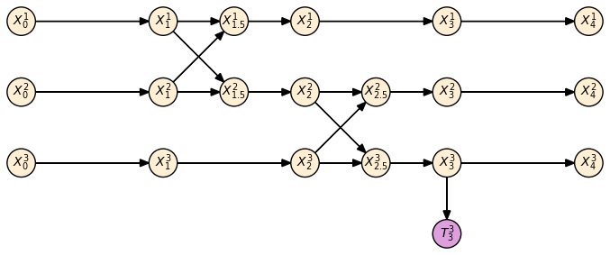

# Bayesian Network Approach

## Introduction

This page describes how we can model the infection using Bayesian networks, and apply the Belief Propagation (BP) algorithm to infer the likelihood that each person is infected.

I will assume that we have the following observations:

* For every person, we know which other people they have came in contact with, and the time of the contact.
* For some people we have test results (which are not 100% reliable).
* For some people at specific times for which we are certain that they are infected.

(We can extend this framework for other cases, such as the case of not having perfect knowledge of all the contact events).

The goal is to infer for each person, the likelihood that he\she is infected at the present, given all the observations that we have.

## Bayesian Networks

A [Bayesian network](https://en.wikipedia.org/wiki/Bayesian_network) is a directed, acyclic graph, where each node represents a random variable, and given the parents of this node, the random variable does not conditionally depend on any other of its ancestors in the graph.

In our case, the graph will have the following types of nodes:

* **Status nodes** - $X^i_t$ - equals 1 if person $i$ is infected at time $t$, and 0 otherwise.
* **Test nodes** - $T^i_t$ - equals 1 if a test done at time $t$  for person $i$  was positive, and 0 otherwise.

The status nodes for person $i$  exist only for times $t$  in the union of the set of values on some regular grid (e.g. once a day), with the set of the times of proximity events for the person. A "proximity event" is an event where the person was in the close proximity of another person. 

A status node always has as a parent the status node of the same person in the preceding time. It can also have at most one other parent - the status node of a different person at its preceding time. If a status node has only one parent - the edge between the parent and the status node represents a time lapse. If the status node has two parents - this represents a proximity event.

A test node always has one parent and no children. The parent is always a status node. 

Here is an example of a Bayesian network.

This Bayesian network contains three people, and starts at time $t=0\ \text{days}$. In the first day, the only thing that happened is a time lapse. In the second day, person 1 and person 2 meet at time $t=1.5\ \text{days}$.  In the third day, person 2 and person 3 meet at time $t=2.5\ \text{days}$. At time $t=3\ \text{days}$, person 3 was tested.

The idea in a Bayesian network is to use observations of a subset of the nodes, to infer the likelihood of the other nodes. For example, if we know the result of the test $T^3_3$, and we know that $X^1_4=1$ (that is, we know that person 1 was sick at time 4), then we can obtain a maximum likelihood estimation for all other nodes. 

## Inference

To obtain the maximum likelihood estimation for the value of each node in the graph, we need the following ingredients:

* A prior for each node: $P(X^i_t=1 )$. Notice that this is a prior and therefore is not conditioned on anything else in the graph (in particular, it is not conditioned on any proximity event).
* A probabilistic model for each node in the graph, given its parents. For example:
  * For a time lapse edge (look at the graph above):
     $P(X^1_1=1\vert X^1_0=x)=\gamma x$  
    (where $\gamma$ represents the healing rate per one day).
  * For a proximity event edge (look at the graph above): 
    $P(X^1_{1.5}=1\vert X^1_1=x,X^2_1=y)=x+\beta (1-x)y$  
    (where $\beta$ represents the infection probability).
  * For a test node (look at the graph above): 
     $P(T^3_3=1\vert X^3_3=x)=\alpha x+ \delta(1-x)$
    where $\alpha$ is the true-positive probability of the test, and $\delta$ is the false positive probability of the test.
* An inference algorithm. A standard choice is [belief propagation (BP)](https://en.wikipedia.org/wiki/Belief_propagation), but there are [other options](https://en.wikipedia.org/wiki/Bayesian_network#Inferring_unobserved_variables) as well. Henceforth I will assume that we are using BP.

## Description of algorithm

### High level description

For each new observation, we perform an update. An observation can be:

* A new proximity event.
* A new test result.
* A new day.

For each observation, we start by updating the graph structure, and then we run BP on the graph. After convergence, we will obtain likelihoods for $X^i_T$ at the current time $T$ for all people $i$. (that is, we obtain for all people the likelihood that they are infected). These likelihoods will be the input to a policy which decides how to treat the people.  

### Belief propagation

#### Log likelihood ratios

All of the nodes in the graph are Bernoulli random variables. For a node $A$, and a set of observations $O$, the likelihood ratio is $\frac{P(O\vert A=1)}{P(O \vert A=0)}$.  The log-likelihood-ratio (LLR) is: 
$L(A,O)=\log(\frac{P(O\vert A=1)}{P(O \vert A=0)})$

(clarification - $O$ is an event, not a random variable).

The values of LLRs can be anything in $\{ -\infty,+\infty \}$. A very positive value means that there is a high likelihood that $A=1$. A very negative value means that there is a high likelihood that $A=0$.

#### Message passing

I will add a more concise description of BP later. For now, this is just a high-level description.

BP is a "message passing" algorithm. This means that on each iteration, each node receives a message from all of its adjacent nodes (regardless of the arrow directions). The contents of an incoming messages sent to a node $A$ from a node $B$ along an edge is simply the LLR of the node $A$ given all the information that node $B$ has received along all other edges. The combination is done using the probabilistic model. All messages are initialized to $0$,  and then we start passing messages from nodes for which we have observations. The content of a message from a node is simply the LLR of the node given all the messages that it received.

For example, in the graph above, suppose that we have the observation $T^3_3=1$.  We pass the message from $T^3_3$ to $X^3_3$ , with value   $L_1=L(X^3_3,T^3_3=1). $  This can be calculated using the probabilistic model. The message from $X^3_3$ to $ X^3_{2,5}$  is obtained by combining $L_1$ and the message from $X^3_4$ to $X^3_3$ whose value we denote by $L_2$ , but we take it to be zero initially (unless we have an observation for $X^3_4$). From this, it can be shown that the message from  $X^3_3$ to $ X^3_{2,5}$  should be: $\frac{P(X^3_3=0 \vert X^3_{2,5}=1)+e^{L_1+L_2}P(X^3_3=1 \vert X^3_{2,5}=1)}{P(X^3_3=1 \vert X^3_{2,5}=0)+e^{L_1+L_2}P(X^3_3=0 \vert X^3_{2,5}=0)}$ , which can be calculated from the probabilistic model. 

We continue passing messages along the graph, in all directions, until convergence. After convergence, we look at the LLR at the nodes of interest to us (all people at the latest time), and we can make decisions for these people based on our policy. (Notice that when passing a message in the direction of an arrow, we need to use the prior probabilities.)

The BP algorithm is known to converge exactly for the case of a graph without loops (a tree), after two full iterations of the graph. In our case, we have loops (loops are defined without regarding arrow directions), so there is no proof of convergence. However, the algorithm is known to yield good results also in the loopy case.

Whether BP is practical for use depends on several factors: The size of the graph we will use; the number of iterations required for convergence; the spasticity of the adjacency matrix of the graph; the number of loops in the graph.

As mentioned above, there are also other algorithm we can use for inference of a Bayesian network.